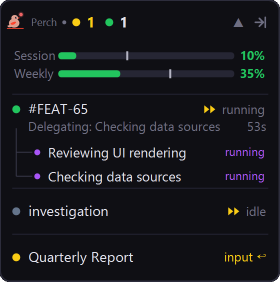

<h1 align="center">Perch</h1>
<p align="center">
 
</p>

<p align="center">
<strong>Keep an eye on every Claude Code session from one floating panel.</strong>
</p>

<br>

Perch is a Windows system-tray app that watches your active Claude Code sessions and surfaces what each one is doing — at a glance, without alt-tabbing through a dozen terminals. When a session finishes, gets stuck on a permission prompt, or needs you, you'll know.

Already know you want it? [Skip the details and install it ▼](#install)

### At a glance

<table>
<tr>
<td width="280" valign="center">

</td>
<td valign="top">

- **One panel for every session** — see who's **running**, **idle**, **awaiting input**, or **needs attention**, each with a colour-coded dot and a live count in the header.
- **Live activity** — the current tool call and an elapsed timer tick by under each running session.
- **Sub-agents, too** — `Task` runs show up as nested rows under their parent.
- **Click to jump** — click any row to focus that session's terminal and clear its alert.
- **Usage at the top** — optional **Session** (5-hour) and **Weekly** rate-limit bars, colour-coded with reset times.
- **Permission badges** — Plan / Accept Edits / Auto / Bypass shown per session (with the plugin installed).
- **Get pinged** — desktop toasts, system chimes, and optional push-to-phone when a session is done or waiting.
- **Stays out of the way** — drag it anywhere, expand/collapse the list, or shrink it to a slim edge-docked strip.

</td>
</tr>
</table>

## How it works

Perch reads Claude Code's own session files under `~/.claude/` and updates in near real time. Each session shows one of four states:

- **Running** — actively executing (with the latest tool call and a runtime timer)
- **Idle** — open but not doing anything
- **Awaiting Input** — stopped on a permission prompt or question and waiting for you
- **Needs Attention** — finished recently and waiting to be acknowledged (the panel flashes and a notification fires)

Click the header to expand it into per-session rows; click a row to focus that session's terminal; drag the header to reposition it.

## Features

### Overlay panel

- Always-on-top panel listing every active session with a colour-coded status dot and header counts.
- Per-session rows show the session's name (folder or `/rename`), its live status, the current tool call, and an elapsed timer.
- Nested rows for running **sub-agents** (`Task` tool runs).
- **Click a row to focus** the terminal running that session and acknowledge any pending alert.
- **Right-click a row** for quick actions: view history, toggle push notifications, acknowledge alert.
- **Drag** to reposition; the panel remembers where you put it.
- **Expand / collapse** the session list by clicking the header; it auto-collapses when the last session ends and flashes open when one needs you.
- **Dense mode** — shrink the panel to a slim strip docked to a screen edge that expands on hover.

### Usage & rate limits

- Optional **Session (5-hour)** and **Weekly (7-day)** usage bars, colour-coded from green to red as you approach your limit.
- Percentage labels and **reset-time** counters.
- An **expected-rate marker** shows where your usage _should_ be for how far into the window you are.
- Hover for a detailed tooltip; bars dim when the data is stale.
- Pulls the same account usage Claude Code's `/usage` command shows — and when the feature is off, it never makes the call.

### Notifications

- **Desktop toasts** when a session finishes or starts awaiting input — click one to jump straight to that terminal.
- **System chimes** for done / waiting, honouring your Windows sound scheme.
- **Push to your phone** via [ntfy](https://ntfy.sh) — opt in per session (or via `/afk`), with an optional "Open session" button for sessions controlled from claude.ai.
- **Away override** — when your workstation is locked, push _any_ session's alerts so you never miss one while you're AFK.
- Independent on/off toggles for every notification type, each with a test button.

### Stats & history

- **Stats dashboard** — sessions, active time, prompts, tool calls, sub-agent runs, streaks, busiest day, and longest session, scoped to **Today / 7 days / 30 days / All time**.
- **Tokens & cost** — input/output/cache token totals plus an optional estimated API cost, broken down by model.
- **Breakdowns** — by project, by tool, by model, by branch, plus an hourly-activity histogram and a daily-trend chart.
- Optional **"Today" line in the tray menu** for a quick daily glance.
- **History viewer** — read any session transcript in a clean **Readable** view (markdown, expandable tool calls, clickable image links) or a **Raw** event timeline, with live follow-along while a session runs.

### Quick links

- A strip of app icons below the usage bars for one-click launching (e.g. Slack, GitKraken).
- Click to focus the app if it's already running, or launch it if not.
- Fully customisable — add, edit, enable/disable links, with presets for well-known apps.

### Companion plugin

Install the Claude Code plugin (one click from **Settings → Plugin Control**) to unlock:

- **Permission-mode badges** in the overlay (Plan / Accept Edits / Auto / Bypass).
- **`/afk`** — toggle push notifications for the current session from the terminal.
- **`/history`** — pop open the history viewer for the current session.
- **Auto-start** — launch Perch automatically when you open your first session (and optionally close it after the last one ends).

### The little things

- Lives in the system tray; left-click opens Settings, right-click for the full menu.
- Dark theme throughout, high-DPI aware.
- Heavy work runs off the UI thread, so the panel never freezes.
- Tolerant of partial/malformed session files — it never crashes on bad data.

## Installing

Download `PerchSetup.exe` from the [latest release](https://github.com/ArcticGizmo/perch/releases/latest) and run it.

- No admin rights required — installs to `%LocalAppData%\Perch\`
- Starts automatically after install
- Adds a Start Menu shortcut and a standard uninstaller (Settings → Apps)

## Updating

Right-click the system tray icon and select **Check for Updates...**

The app will download the latest release and restart automatically.

## Building a release (maintainers)

Releases are created by pushing a version tag. GitHub Actions handles the build and publishes the artifacts to the GitHub Release automatically.

**Steps:**

1. Bump `<Version>` in `src/Perch.App.Avalonia/Perch.App.Avalonia.csproj` to the new version (e.g. `0.2.0`)
2. Commit the change
3. Push a matching tag:
   ```
   git tag v0.2.0
   git push origin v0.2.0
   ```
4. GitHub Actions builds, packs, and uploads the installer to the release page

Teammates can then use **Check for Updates...** in the tray to get the new version.

### Building locally (optional)

If you want to produce release artifacts without pushing a tag, install the `vpk` CLI once:

```
dotnet tool install -g vpk
```

Then run:

```
publish.bat
```

Artifacts land in `releases/`. Upload them manually to a GitHub Release tagged to match the version in the csproj.

## Development

Requirements: .NET 10 SDK

```
dotnet run --project src/Perch.App.Avalonia
```

The UI is [Avalonia](https://avaloniaui.net/). To eyeball owner-drawn surfaces without launching the tray,
render them to PNG (1× and 1.5×):

```
dotnet run --project src/Perch.App.Avalonia -- render out
```

### Icons

The app's logo lives in a single source-of-truth vector file, [`perch.svg`](./perch.svg). Every raster
asset — the tray icon, the `.exe` icon, the in-app logo, and the README header — is generated from it,
so the icon stays crisp at any size and there's only one file to edit.

After changing `perch.svg`, regenerate the assets and commit the results:

```
powershell tools/gen-icons.ps1   # PowerShell
tools\gen-icons.cmd              # cmd
# or directly: dotnet run --project tools/IconGen
```

This writes `src/Perch.App.Avalonia/Assets/icon.png` (256×256), `src/Perch.App.Avalonia/Assets/icon.ico`
(multi-resolution), and `landing-icon.png` (512×512).
