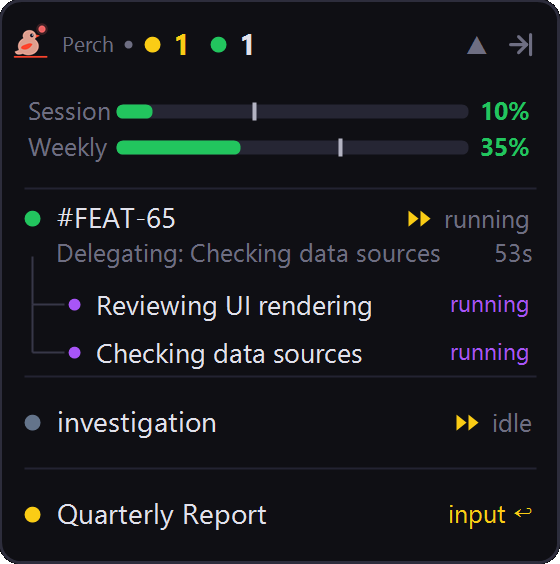

<h1 align="center">Perch</h1>
<p align="center">
 
</p>

<p align="center">
<strong>Keep an eye on every Claude Code session from one floating panel.</strong>
</p>

<br>

Perch is a **Windows and macOS** menu-bar / system-tray app that watches your active Claude Code sessions and surfaces what each one is doing — at a glance, without alt-tabbing through a dozen terminals. When a session finishes, gets stuck on a permission prompt, or needs you, you'll know.

Already know you want it? [Skip the details and install it ▼](#Installing)

### At a glance

<table>
<tr>
<td width="280" valign="center">

</td>
<td valign="top">

- **One panel for every session** — see who's **running**, **idle**, **awaiting input**, or **needs attention**, each with a colour-coded dot and a live count in the header.
- **Live activity** — the current tool call and an elapsed timer tick by under each running session.
- **Sub-agents, too** — `Task` runs show up as nested rows under their parent.
- **Click to jump** — click any row to focus that session's terminal and clear its alert.
- **Usage at the top** — optional **Session** (5-hour) and **Weekly** rate-limit bars, colour-coded with reset times.
- **Permission badges** — Plan / Accept Edits / Auto / Bypass shown per session (with the plugin installed).
- **Get pinged** — desktop toasts, system chimes, and optional push-to-phone when a session is done or waiting.
- **Stays out of the way** — drag it anywhere, expand/collapse the list, or shrink it to a slim edge-docked strip.

</td>
</tr>
</table>

## How it works

Perch reads Claude Code's own session files under `~/.claude/` and updates in near real time. Each session shows one of four states:

- **Running** — actively executing (with the latest tool call and a runtime timer)
- **Idle** — open but not doing anything
- **Awaiting Input** — stopped on a permission prompt or question and waiting for you
- **Needs Attention** — finished recently and waiting to be acknowledged (the panel flashes and a notification fires)

Click the header to expand it into per-session rows; click a row to focus that session's terminal; drag the header to reposition it.

## Features

### Overlay panel

- Always-on-top panel listing every active session with a colour-coded status dot and header counts.
- Per-session rows show the session's name (folder or `/rename`), its live status, the current tool call, and an elapsed timer.
- Nested rows for running **sub-agents** (`Task` tool runs).
- **Click a row to focus** the terminal running that session and acknowledge any pending alert.
- **Right-click a row** for quick actions: view history, toggle push notifications, acknowledge alert.
- **Drag** to reposition; the panel remembers where you put it.
- **Expand / collapse** the session list by clicking the header; it auto-collapses when the last session ends and flashes open when one needs you.
- **Dense mode** — shrink the panel to a slim strip docked to a screen edge that expands on hover.

### Usage & rate limits

- Optional **Session (5-hour)** and **Weekly (7-day)** usage bars, colour-coded from green to red as you approach your limit.
- Percentage labels and **reset-time** counters.
- An **expected-rate marker** shows where your usage _should_ be for how far into the window you are.
- Hover for a detailed tooltip; bars dim when the data is stale.
- Pulls the same account usage Claude Code's `/usage` command shows — and when the feature is off, it never makes the call.

### Notifications

- **Desktop toasts** when a session finishes or starts awaiting input — click one to jump straight to that terminal.
- **System chimes** for done / waiting, honouring your Windows sound scheme.
- **Push to your phone** via [ntfy](https://ntfy.sh) — opt in per session, with an optional "Open session" button for sessions controlled from claude.ai.
- **Away override** — when your workstation is locked, push _any_ session's alerts so you never miss one while you're AFK.
- Independent on/off toggles for every notification type, each with a test button.

### Stats & history

- **Stats dashboard** — sessions, active time, prompts, tool calls, sub-agent runs, streaks, busiest day, and longest session, scoped to **Today / 7 days / 30 days / All time**.
- **Tokens & cost** — input/output/cache token totals plus an optional estimated API cost, broken down by model.
- **Breakdowns** — by project, by tool, by model, by branch, plus an hourly-activity histogram and a daily-trend chart.
- Optional **"Today" line in the tray menu** for a quick daily glance.
- **History viewer** — read any session transcript in a clean **Readable** view (markdown, expandable tool calls, clickable image links) or a **Raw** event timeline, with live follow-along while a session runs.

### Quick links

- A strip of app icons below the usage bars for one-click launching (e.g. Slack, GitKraken).
- Click to focus the app if it's already running, or launch it if not.
- Fully customisable — add, edit, enable/disable links, with presets for well-known apps.

### Live session state

Perch wires a few hooks into Claude Code for you — no plugin to install. On launch it points
`~/.claude/settings.json` at its own fast `perch-hook` binary, keeps it current across updates, heals
stale entries, and removes them cleanly on uninstall. That unlocks:

- **Permission-mode badges** in the overlay (Plan / Accept Edits / Auto / Bypass).
- **Auto-start** — launch Perch automatically when you open your first session (and optionally close it after the last one ends).

### The little things

- Lives in the system tray; left-click opens Settings, right-click for the full menu.
- Dark theme throughout, high-DPI aware.
- Heavy work runs off the UI thread, so the panel never freezes.
- Tolerant of partial/malformed session files — it never crashes on bad data.

## Installing

### Windows

```powershell
irm https://raw.githubusercontent.com/ArcticGizmo/perch/main/install.ps1 | iex
```

That's the whole install. No admin rights (it lands in `%LocalAppData%\Perch\`), a Start Menu shortcut and a
normal uninstaller in Settings → Apps, and Perch starts in the tray when it's done. Every update after this
is in-app: right-click the tray icon → **Check for Updates…**.

What the script does, in order: resolves the latest release, fetches `SHA256SUMS.txt` and
`Perch-win-Setup.exe`, **checks the installer against the manifest and deletes it rather than run it on any
mismatch**, then hands off to the installer. It's [`install.ps1`](install.ps1) in this repo — read it before
piping it into your shell, the same as you should with any installer.

Pin a version instead of taking the latest:

```powershell
$env:PERCH_VERSION = '0.2.34'; irm https://raw.githubusercontent.com/ArcticGizmo/perch/main/install.ps1 | iex
```

Because PowerShell rather than a browser does the downloading, nothing is tagged with the mark-of-the-web —
so this route never hits the **"Windows protected your PC"** SmartScreen wall.

### Windows — installer by hand

Prefer to click things: download `Perch-win-Setup.exe` from the
[latest release](https://github.com/ArcticGizmo/perch/releases/latest) and run it. Identical install,
identical self-updates.

A browser download *is* tagged with the mark-of-the-web, so SmartScreen shows the blue **"Windows protected
your PC"** dialog — click **More info → Run anyway**, or use the one-liner above and skip it. To check the
download against the release's `SHA256SUMS.txt` yourself:

```powershell
$want = (Select-String -Path SHA256SUMS.txt -Pattern 'Perch-win-Setup.exe').Line.Split()[0]
(Get-FileHash Perch-win-Setup.exe -Algorithm SHA256).Hash -eq $want   # True
```

### macOS (Apple Silicon, unsigned)

1. Download the `…-osx-arm64.dmg` from the [latest release](https://github.com/ArcticGizmo/perch/releases/latest).
2. Open the `.dmg` and drag **Perch** to the **Applications** folder.
3. Clear the quarantine flag (see below), then launch Perch from Applications.

Every release also publishes a `SHA256SUMS.txt` covering all of its assets, if you want to check the
download first: `shasum -a 256 -c SHA256SUMS.txt --ignore-missing`.

The mac build is **not yet code-signed or notarized**. When macOS downloads an unsigned app it tags it
with a `com.apple.quarantine` flag, and Gatekeeper then refuses to open it — showing **"Perch is damaged
and can't be opened. You should move it to the Trash."** The app isn't actually damaged; that misleading
message just means the quarantine flag is set. Remove it once, from **Terminal**:

```sh
xattr -cr /Applications/Perch.app
```

Then open Perch normally (double-click, or right-click → **Open**). You only need to do this once per
install/update.

> **Note:** on macOS Sonoma/Sequoia the old "right-click → Open" bypass no longer clears a *damaged*
> verdict — you must run the `xattr` command above. If you dragged Perch somewhere other than
> `/Applications`, point the command at wherever `Perch.app` actually lives.

If the `.dmg` **itself** won't open ("damaged"), the quarantine is on the download — clear it on the disk
image first, then reopen it:

```sh
xattr -cr ~/Downloads/Perch-osx-arm64.dmg
```

Perch runs as a menu-bar app — there's no Dock icon. On first launch it symlinks `perch` into
`~/.local/bin`, wires its Claude Code hooks, and may raise one-time macOS prompts: **Notifications**, and
an **Automation** prompt to control Terminal (needed to focus the terminal window running a session — if
you decline, click-to-focus falls back to just bringing the terminal app forward).

## Updating

Perch watches for new releases in the background whichever way you installed it — who *installs* them
depends on the channel:

| Installed with | How it updates |
| --- | --- |
| `install.ps1`, `Perch-win-Setup.exe`, or the `.dmg` | Right-click the tray icon → **Check for Updates…**. Perch downloads the release and restarts itself. |
| Portable zip | Download the new release and replace the folder. |

The one-liner is only a verified download-and-run wrapper around the installer, so an install through it is
an ordinary installed copy — Velopack owns everything from there, and you never need to re-run the script.
Only the hand-extracted portable zip is outside that: Perch will tell you a new version exists but won't
rewrite a directory it doesn't own.

## Building a release (maintainers)

Releases are created by pushing a version tag. GitHub Actions handles the build and publishes the artifacts to the GitHub Release automatically.

**Steps:**

1. Bump `<Version>` in `src/Perch.App/Perch.App.csproj` to the new version (e.g. `0.2.0`)
2. Commit the change
3. Push a matching tag:
   ```
   git tag v0.2.0
   git push origin v0.2.0
   ```
4. GitHub Actions builds and packs both platforms, then the `release` job flattens every artifact into one
   directory, writes `SHA256SUMS.txt` over it, and uploads the lot to the release page

Teammates can then use **Check for Updates...** in the tray to get the new version.

### Checksums (maintainers)

`SHA256SUMS.txt` is generated in the `release` job from the exact files about to be uploaded — never in a
build job — so it can't drift from what users download. It's plain `sha256sum` format, so
`sha256sum -c SHA256SUMS.txt` works on it directly.

Two guards run before it's written, because [`install.ps1`](install.ps1) depends on the result and a silently
wrong manifest is worse than a failed release:

- a duplicate asset basename across the Windows and macOS jobs fails the release rather than publishing one
  of two different files under one name;
- a missing `Perch-win-Setup.exe` fails the release, since the one-liner resolves that asset by name.

`install.ps1` refuses to install a release that has no `SHA256SUMS.txt` — which includes every release
published before this was added, so pinning `$env:PERCH_VERSION` to an old version won't work. If you ever
hand-upload a release, run `publish.bat` (it writes the same manifest into `releases\`) and include the file.

**What this does and doesn't buy.** Checksums prove the bytes you ran are the bytes that were published —
they catch truncated downloads, a proxy or mirror rewriting the payload, and tampering anywhere between
GitHub and the disk. They are *not* a signature: the manifest lives on the same release as the installer, so
anyone who could replace one could replace both. Closing that gap needs code signing (or at minimum GitHub
build-provenance attestation) — see [`docs/distribution-plan.md`](docs/distribution-plan.md).

### Building locally (optional)

If you want to produce release artifacts without pushing a tag, install the `vpk` CLI once:

```
dotnet tool install -g vpk
```

Then run:

```
publish.bat        # Windows: Perch-win-Setup.exe + SHA256SUMS.txt
./publish-mac.sh   # macOS (Apple Silicon): unsigned Perch.app + .dmg
```

Artifacts land in `releases/`. Upload them manually to a GitHub Release tagged to match the version in the
csproj — including `SHA256SUMS.txt`, or `install.ps1` won't install that release. Note that `publish.bat`
hashes everything currently in `releases\`, which accumulates older versions' `.nupkg`s locally; CI starts
from a clean artifact set.

The mac build is arm64-only and unsigned (see the [macOS install note](#macos-apple-silicon-unsigned) for
the Gatekeeper workaround). `publish-mac.sh` regenerates `Assets/icon.icns` on demand via
[`tools/gen-icns.sh`](tools/gen-icns.sh) if it's missing.

## Development

Requirements: .NET 10 SDK

```
dotnet run --project src/Perch.App
```

The UI is [Avalonia](https://avaloniaui.net/). To eyeball owner-drawn surfaces without launching the tray,
render them to PNG (1× and 1.5×):

```
dotnet run --project src/Perch.App -- render out
```

### Icons

The app's logo lives in a single source-of-truth vector file, [`perch.svg`](./perch.svg). Every raster
asset — the tray icon, the `.exe` icon, the in-app logo, and the README header — is generated from it,
so the icon stays crisp at any size and there's only one file to edit.

After changing `perch.svg`, regenerate the assets and commit the results:

```
powershell tools/gen-icons.ps1   # PowerShell
tools\gen-icons.cmd              # cmd
# or directly: dotnet run --project tools/IconGen
```

This writes `src/Perch.App/Assets/icon.png` (256×256), `src/Perch.App/Assets/icon.ico`
(multi-resolution), and `landing-icon.png` (512×512).

The macOS app icon (`src/Perch.App/Assets/icon.icns`) is regenerated separately, on a Mac, from
`landing-icon.png` — the IconGen path above renders the SVG through System.Drawing, which only runs on
Windows:

```
tools/gen-icns.sh
```
